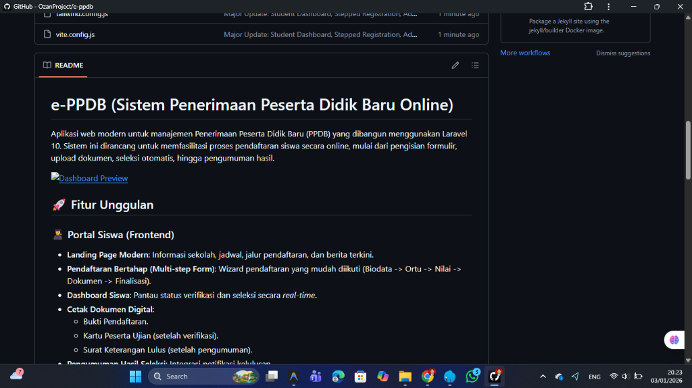

# e-PPDB (Sistem Penerimaan Peserta Didik Baru Online)

Aplikasi web modern untuk manajemen Penerimaan Peserta Didik Baru (PPDB) yang dibangun menggunakan Laravel 12. Sistem ini dirancang untuk memfasilitasi proses pendaftaran siswa secara online, mulai dari pengisian formulir, upload dokumen, seleksi otomatis, hingga pengumuman hasil.



## 🚀 Fitur Unggulan

### 👨‍🎓 Portal Siswa (Frontend)
*   **Landing Page Modern**: Informasi sekolah, jadwal, jalur pendaftaran, dan berita terkini.
*   **Pendaftaran Bertahap (Multi-step Form)**: Wizard pendaftaran yang mudah diikuti (Biodata -> Ortu -> Nilai -> Dokumen -> Finalisasi).
*   **Dashboard Siswa**: Pantau status verifikasi dan seleksi secara *real-time*.
*   **Cetak Dokumen Digital**:
    *   Bukti Pendaftaran.
    *   Kartu Peserta Ujian (setelah verifikasi).
    *   Surat Keterangan Lulus (setelah pengumuman).
*   **Pengumuman Hasil Seleksi**: Integrasi notifikasi kelulusan.

### 🏫 Panel Admin (Backend)
*   **Manajemen Sekolah**: Edit profil, logo, kepsek, dan media sosial sekolah.
*   **Pengaturan PPDB**: Kelola Tahun Ajaran, Jalur Pendaftaran (Zonasi/Prestasi/dll), Kuota, dan Jadwal.
*   **Manajemen Pendaftar**:
    *   Verifikasi dokumen siswa (KK, Akta, dll).
    *   Validasi nilai rapor.
*   **Mesin Seleksi Otomatis**: Ranking siswa berdasarkan nilai rata-rata/skor secara otomatis.
*   **Manajemen Pengumuman**: Publish/Unpublish hasil seleksi per jalur.
*   **Laporan & Ekspor**: Cetak laporan rekapitulasi ke PDF dan Excel.
*   **Manajemen Konten (CMS)**: Posting berita dan pengumuman sekolah.
*   **Manajemen Pengguna**: Role-based Access Control (Admin, Panitia, Siswa).
*   **Activity Logs**: Pantau aktivitas sistem dan keamanan.

## 🛠️ Teknologi yang Digunakan

*   **Framework**: [Laravel 12](https://laravel.com/) (PHP)
*   **Database**: MySQL
*   **Frontend**: Tailwind CSS (Landing Page), Bootstrap 5 (Admin Template - DarkPan)
*   **Authentication**: Laravel Breeze
*   **Authorization**: Spatie Laravel Permission
*   **PDF Generation**: Barryvdh DomPDF
*   **Excel Export**: Maatwebsite Excel
*   **Activity Log**: Spatie Activitylog

## 📦 Instalasi

Ikuti langkah-langkah berikut untuk menjalankan aplikasi di komputer lokal Anda:

1.  **Clone Repository**
    ```bash
    git clone https://github.com/OzanProject/e-ppdb.git
    cd e-ppdb
    ```

2.  **Install Dependencies**
    ```bash
    composer install
    npm install
    ```

3.  **Konfigurasi Environment**
    *   Duplikat file `.env.example` menjadi `.env`.
    *   Atur koneksi database di file `.env`.
    ```bash
    cp .env.example .env
    php artisan key:generate
    ```

4.  **Setup Database & Storage**
    Pastikan database sudah dibuat di MySQL, lalu jalankan migrasi dan seeder.
    ```bash
    php artisan migrate:fresh --seed
    php artisan storage:link
    ```

5.  **Jalankan Aplikasi**
    ```bash
    npm run build
    php artisan serve
    ```
    Buka `http://127.0.0.1:8000` di browser.

## 🔐 Akun Default (Seeder)

*   **Administrator**:
    *   Email: `admin@example.com`
    *   Password: `password`
*   **Siswa (Demo)**:
    *   Email: `siswa@example.com`
    *   Password: `password`

## 📄 Lisensi

Project ini open-source di bawah lisensi [MIT license](https://opensource.org/licenses/MIT).

---
*Dibuat dengan ❤️ untuk kemajuan pendidikan Indonesia.*
